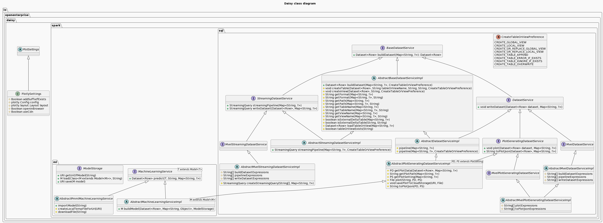

# Daisy
## What is Daisy?
Daisy stands for **D**ata **A**ggregation & **I**ntellectualizing **Sy**stem. It is
a simple (low code) data lake-house (wanna be) which built around Apache Spark & Spring Boot.

Updates history of Daisy can be accessed from [here](updates_history.md).

## What can Daisy offer?
* #### Data as a service
  * Allow anyone who has Spark experience to,
    * Built the desired dataset by triggering the aggregation & cleansing of multiple datasets
    * Write the built dataset to desired data sink
    * Plot graph on the desired columns of the built dataset
  * RESTful APIs to build (desired) dataset, write dataset to data sink and plot desired graph
* #### Data pipeline & streaming data pipeline
  * (Streaming) data pipeline(s) by leveraging components which enabled the mentioned features
* #### Machine Learning as a service
  * spark-mllib powered model can be built and prediction can be retrieved with little amount of code by anyone who 
  has experience on Apache Spark.
  * RESTful APIs to invoke model training & getting predictions on the fly.

## Design goals
* #### Low code
  * Data engineers with Apache Spark experience just need to fill in the blanks.
* #### Mainstream frameworks & libraries
  * Can easily be tamed by anyone who has worked with Apache Spark & Spring Boot. 
* #### Minimalistic design
  * Keeping it simple & stupid and does not require a rocket scientist to work with Daisy.

## High level design
Daisy provides 6 components to be extended by data engineers & software engineers. In a way, the implementation of them 
can be viewed as a notebook in Databricks or Jupyter Notebook.



Description of each components can be accessed from [here](updates_history.md).


## RESTful APIs
Currently, Daisy provides the following APIs out of the box. The OpenAPI spec can be found [here](src/main/resources/openapi.yaml).

### DatasetApiImpl

[DatasetApiImpl](src/main/java/io/openenterprise/daisy/rs/DatasetApiImpl.java) provides the following endpoints:

#### buildDataset
POST (http|https:)//$host:$port/services/datasets/{beanName}?createTableOrViewPreference=$createTableOrViewPreference

### MlApiImpl

[MlApiImpl](src/main/java/io/openenterprise/daisy/spark/sql/rs/MlApiImpl.java) provides the following endpoints:

#### getPrediction
POST (http|https)://$host:$port/services/ml/{beanName}/predict?modelId=$modelId

#### trainModel
POST (http|https)://$host:$port/services/ml/{beanName}/train

### PipelineApiImpl

[PipelineApiImpl](src/main/java/io/openenterprise/daisy/spark/sql/rs/PipelinesApiImpl.java) provides the following endpoints:

#### triggerPipeline
POST (http|https)://$host:$port/services/pipelines/{beanName}/trigger

Click [here](src/main/resources/openapi.yaml) for the OpenAPI 3 definition for all the endpoints.

## Caveats
* Currently, Daisy is engineered to be run in Spark client mode. In another words, Daisy need to be hosted on its own,
be it the Docker engine/Kubernetes/physical server/VM.

* Due to the fact that Daisy right now can only run in Spark client mode. It can only be run in a single node for most 
of its operations. This may be an issue if want to deploy Daisy to a production environment. Such concern may not be as
significant if Daisy is being deployed to something like ECS as the ECS engine will try to start a new instance. The 
followings operations may not be limited by this constraint.

```markdown
1. Import a pre-build Spark ML model from another Daisy instance for prediction.
2. Import a PMML file from remote for prediction.
```

